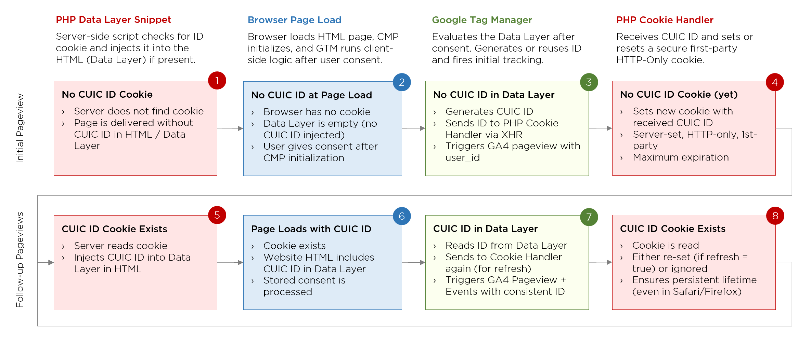

# GTM Custom User ID Cookie (CUIC)

Consent-based, long-lived first-party ID cookie for privacy-friendly user tracking in restrictive environments.

## Overview

**Custom User ID Cookie** enables the generation and secure persistence of a random user ID across sessions using an HTTP-only, first-party cookie. The ID is generated client-side in GTM (based on user consent, if applied) and made available immediately – even before the cookie is set – for GA4 tracking and other downstream integrations.

CUIC is fully compatible with ITP/ETP restrictions and enables stable cross-session identification in Safari and Firefox. It supports the use of user_id in both client- and server-side tracking architectures.

All key behaviors — such as cookie name, expiration, refresh policy, and visibility — are controlled centrally via GTM. No PHP code changes are needed to switch between test and production setups.

## Key Features

* Persistent first-party, secure, HTTP-only cookie (SameSite=Lax)
* ID available on first pageview – usable before the cookie is stored
* Fully consent-controllable via GTM
* Compatible with Safari/Firefox ITP/ETP restrictions
* HTTP-only cookie value accessible via GTM data layer 
* Entire behavior (refresh, name, expiration) controlled via GTM
* Optional fallback via  if XHR is blocked
* Ideal for GA4 user_id and server-side tracking setups

## What Problem Does CUIC Solve?

| 🔍 Problem                                                                                                            | ✅ CUIC Solution                                                                                                                               |
|:--------------------------------------------------------------------------------------------------------------------- |:--------------------------------------------------------------------------------------------------------------------------------------------- |
| 1st-party, long-lived cookie required, but:  only valid if set server-side with secure, same-origin conditions | CUIC sets the cookie server-side on the main domain using PHP — not via JavaScript                                                        |
| Consent is required before setting any ID, including via server                                                   | CUIC integrates seamlessly with GTM consent triggers, ensuring privacy compliance                                                         |
| GA4 and server must use the same ID immediately, even before the cookie exists                                    | CUIC uses a central variable (`jsUserIdResolve`) to generate or reuse the ID and send it simultaneously to GA4 and the cookie handler |
| On subsequent pageviews, the HttpOnly cookie is not accessible via JS, and the ID must still be available in GTM  | CUIC exposes the cookie value via a PHP dataLayer snippet (`cuic_datalayer-snippet.php`), making the ID available before GTM loads    |
| Multiple entry points / pageviews must not generate multiple IDs                                                  | CUIC ensures consistent logic in both GTM and PHP: existing values are always reused if present (in dataLayer or cookies)                 |
| Safari and Firefox block or shorten JS-set cookies                                                                | CUIC fully complies with Safari/Firefox ITP: 1st party, secure, SameSite=Lax, server-set, HttpOnly                                            |
| XHR requests may fail due to ad blockers or ITP                                                                   | CUIC includes an automatic fallback using an image GET request if the main XHR fails                                                      |

## Architecture & Data Flow

The diagram below illustrates the CUIC cookie lifecycle across first and subsequent pageviews:

## Components

* **`cuic_cookie-handler.php`** Server-side handler that sets the cookie via POST or GET – supports dynamic config via GTM
* **`cuic_datalayer-snippet.php`** PHP snippet which exposes the cookie value to the `dataLayer` via PHP – required when using `HttpOnly` cookies
* **`cuic_controller.html`** GTM Custom HTML tag that sends the ID to the server – includes XHR logic with fallback image request 
* **`jsUserIdResolve.js`** Central GTM variable that checks for an existing value in the dataLayer (from cookie snippet or previous tag push) or creates a new ID on first pageview – ensures consistent value at all times

## Installation Guide

1. **Deploy the server scripts** to your main domain (same origin as your GTM container):
   - `/cuic_cookie-handler.php`
   - `/cuic_datalayer-snippet.php` (include in `<head>` before GTM)

2. **Create GTM variables**:
   - Add `jsUserIdResolve.js` as a **Custom JavaScript Variable**
   - Name it `jsUserIdResolved` or similar

3. **Add the GTM tag**:
   - Use `cuic_controller.html` as a **Custom HTML Tag**
   - Adjust path to `/cuic_cookie-handler.php` if needed
   - Reference the `jsUserIdResolved` variable in the tag
   - Trigger only **after valid consent**

4. **Make the ID available to GA4**:
   - Use `{{jsUserIdResolved}}` as `user_id` in your GA4 Config and Events

5. **Customize behavior via GTM**:
   - All cookie parameters (`name`, `refresh`, `maxAge`, `httpOnly`) are configurable via inline variables in the tag
   - No PHP edits required

## Consent & Privacy

* CUIC should only run after user consent (fully controlled via GTM)
* No personally identifiable information (PII) is stored
* No fingerprinting, no localStorage
* Fully compliant with ITP, ETP, GDPR, and ePrivacy standards

## Use Case: Testing Multiple Cookie Variants

CUIC makes it easy to test different cookie configurations (e.g. name, expiration, visibility, refresh behavior) **without modifying any server-side code**. Just duplicate the GTM tag (`cuic_controller.html`) and adjust the inline config:

- `cn`: cookie name (e.g. `tkncstm_test`)
- `refresh`: `1` = extend on every visit, `0` = set once
- `httpOnly`: `1` = HTTP-only (default), `0` = JS-readable
- `maxAge`: cookie lifetime in seconds (e.g. `3600` for 1 hour)

You can run **multiple variants in parallel** using different GTM tags and triggers — all handled by the same `cuic_cookie-handler.php` on the server.

## License

MIT – see [LICENSE](./LICENSE)

## Author

/ MEDIAFAKTUR – Marketing Performance Precision, [https://mediafaktur.marketing](https://mediafaktur.marketing)  
Florian Pankarter, [fp@mediafaktur.marketing](mailto:fp@mediafaktur.marketing)
